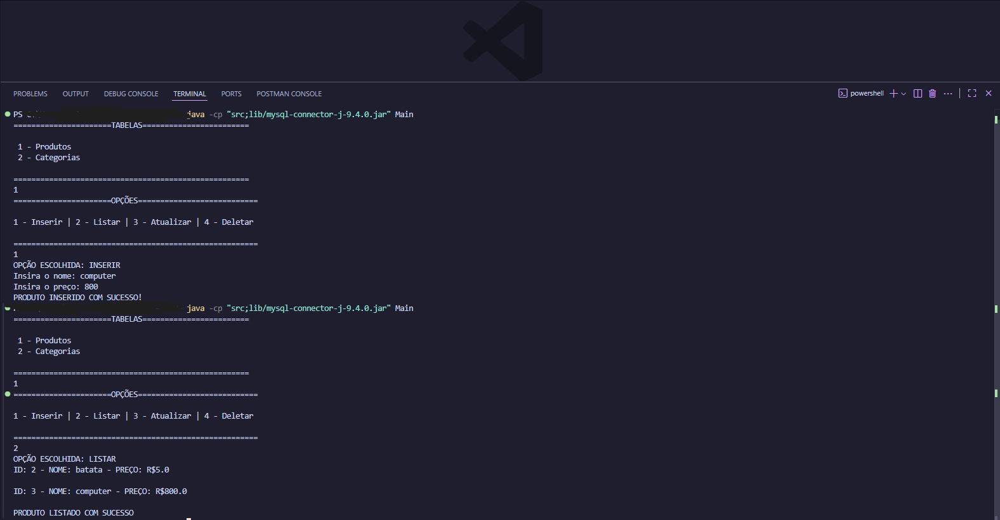
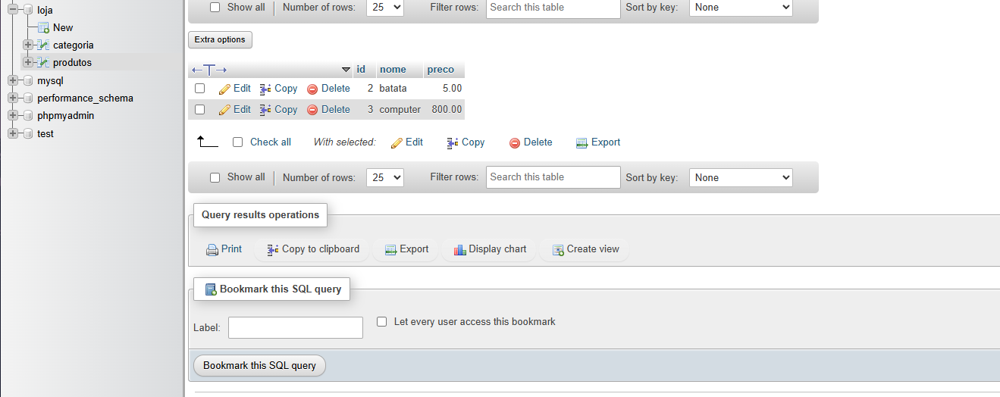

# integration between the Java language and the MySQL database :trophy:
## :rocket: Objective 
The objective of this project was to develop my skills in Java and MySQL by carrying out a practical activity of integrating Java code with the MySQL database, in which I set up a series of options where the user can exercise the 4 basic commands: Create, Read, Update and Delete, the famous CRUD  
## :desktop_computer: Technologies
 
---
## :male_detective: Logic
In my project, I first needed to use an API driver called JDBC (Java Database Connectivity) to connect the database to my code. Next, I developed the Product and Category classes to create a parallel relationship between the database tables. With these classes, we developed other classes responsible for CRUD: ProductDao and CategoryDao. Last but not least, we have the Main class, which executes everything and provides instructions on how to proceed with possible operations in an organized and presentable manner, including error handling where necessary!  
## :pushpin: Application
### 1 - Clone my repository to your machine:  
```bash copy
git clone https://github.com/Breno-V/CRUD-JDBC
```

### 2 - Run the code: 
```bash copy
java -cp "lib/*;." Main
```  
>[!NOTE]
> If that command not work, try this:
>```copy
>java -cp "src;lib/mysql-connector-j-9.4.0.jar" Main
>```

## :key: Results
|Code Working|DataBase in phpMyAdmin|
|------------|----------------------|
|            |                      |

# Thanks for read until here, Bye! :wave: